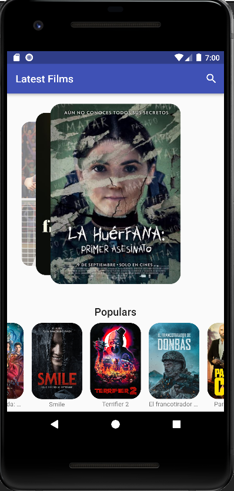

# flutter_films

A flutter project about get information about films from TheMovieDB to do some practise about:
 - Cards
 - Swiper
 - Streams
 - Animations
 - Buildactions
 - Futures
 - Future builders
 - Consume third part http API
 - etc..

Not working on landscape by now (... :) )

From the Fernando Herrera couse at udemy.com

